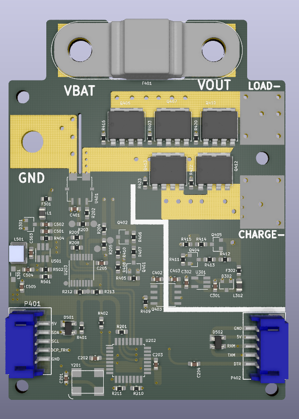
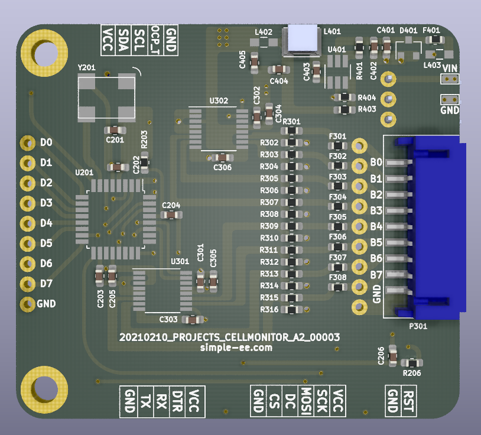
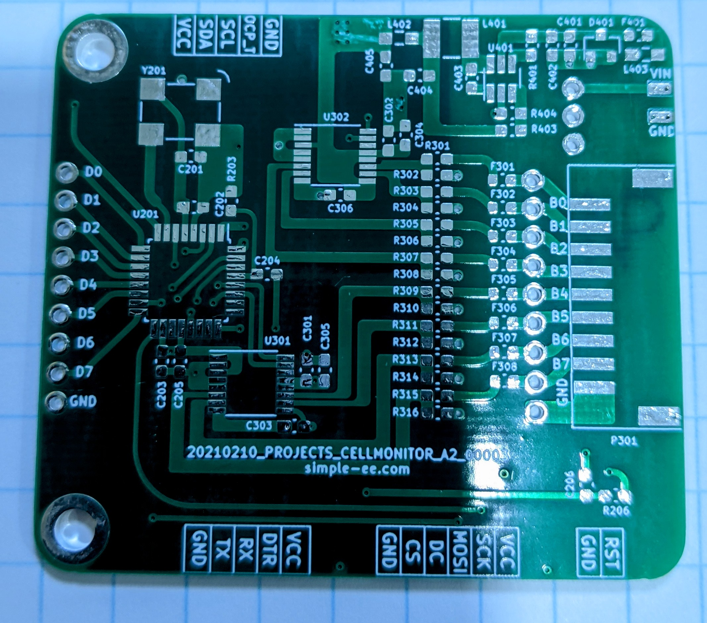
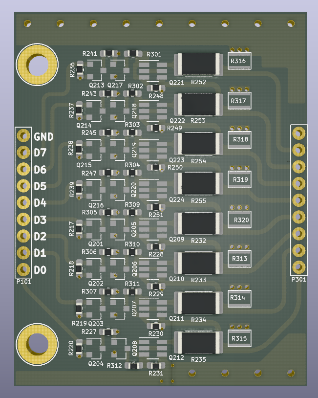
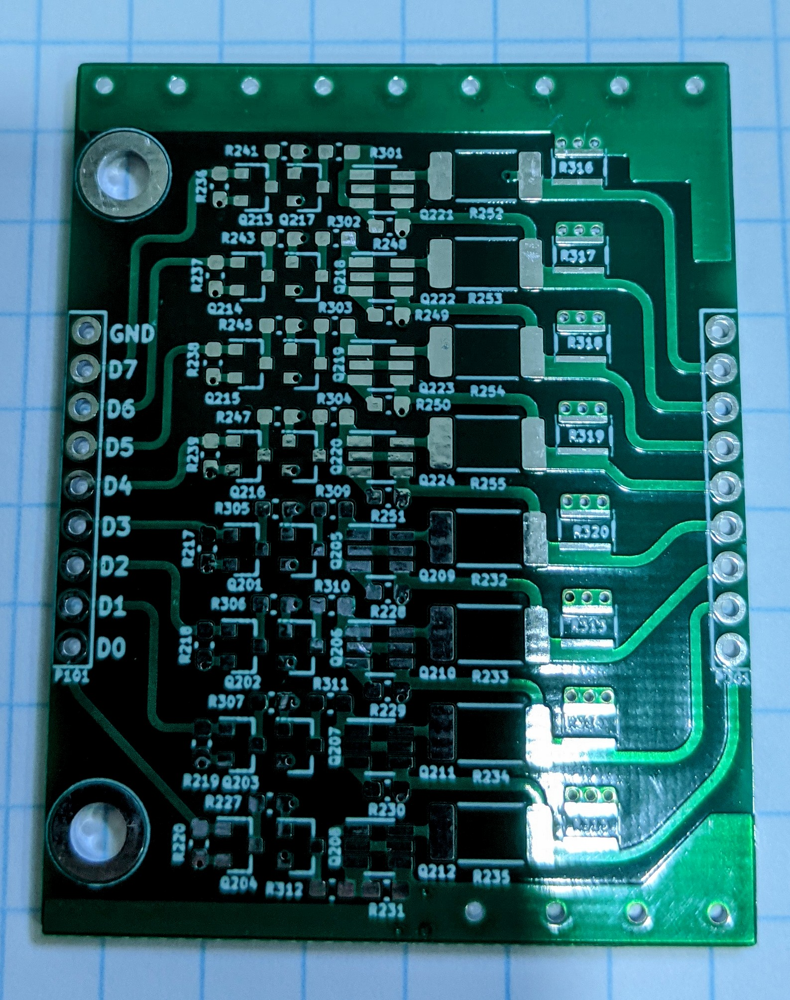
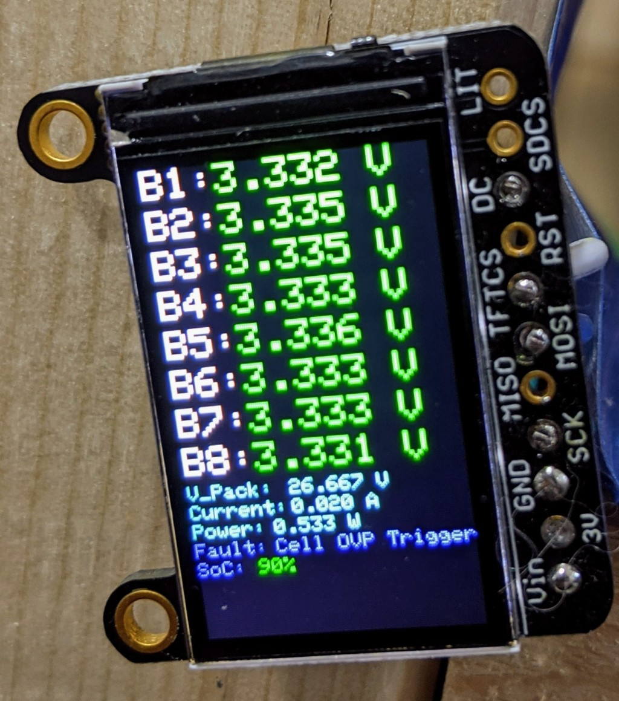

# modular BMS by simple-ee.com
This is what I am calling the modular BMS for an 8S LiFePO4 pack.  I've designed
this as three main parts.  Currently this design is functional and running my
system but I am in the progress of overhauling the design by upgrading from an 
8-bit ATmega328PB to a 32-bit SAMD21G18 using the arduino zero bootloader.

Right now I'm essentially maxed out resources and memory on the atmega328PB and
cannot add anymore features which is why I'm planning on upgrading the design.

Even though this design is now my old design its still very functional and very
stable as it has been running my 4kWh system for about 6 months and protecting 
the cells perfectly.  

The reason for making it a modular design is for easy upgradability and also,
considering the current chip shortage, is to replace sections of the board in
case there are no parts available.  This will prevent the need to redo and 
re-layout of the entire design.

I'm posting this design because I've learned a lot from other projects and feel
this will help a lot of people and want to give back.  Also smarter people than
me could take this design and help optomize the code and design and make this a
community BMS.

## SETUP

### Software/Bootloader
[Software Setup](https://github.com/simple-ee/mBMS/tree/main/Setup)

### Wiring and Connection

## Pinout and Block Diagram

## Board information

### The Protection board

[kicad Files and gerber files](https://github.com/simple-ee/mBMS/tree/main/Schematic/The%20Protection%20Board)

#### Rendered PCB

#### Actual PCB

- This board will handle discharge and charge currents between the battery
and the external world.  
- It has the following specs:

    Item | Description
    -----|------------
    1 | 4-Channel 16-BIT ADC with an effective resolution of 16-Bit at 20sps
    2 | 100A hall effect current sensor
    3 | Up to 3 Discharge N-Channel MOSFETS with 0.7mOhm DCR and 425A current capability. ( Effective current handling per mosfet without heatsink is 30A)
    4 | Up to 2 charge N-Channle MOSFETS with 0.7mOhm DCR and 425A current capability. (Effective current handling per mosfet without heatsink is 30A)
    5 | Optoisolator to drive the charge mosfets as it is floating relative to the battery ground.
    6 | High efficiency buck converter to power the MCU and supporting circuits.
    7 | Low power LDO to power the secondary side of the optoisolator to drive the charge MOSFET
    8 | Two I2C ports, one to act as an internal COM for adc and display, andsecond one to act as external COM to relay information to BMS board
    9 | 125A fuse that will act as the short circuit protection with a breaking capacity of 1kA.

### The BMS Board

[kicad Files and gerber files](https://github.com/simple-ee/mBMS/tree/main/Schematic/The%20BMS%20Board)

#### Rendered PCB

#### Actual PCB

- This board is handling the cell level monitoring function as well as sending
controls to the passive balance resistors for balancing the cells.  It 
incorporates cell level OVP and UVP which is configurable and also receives the
current values from the Protection board via I2C and then displays all values
on a TFT display either ST7735 or ST7789.  If for any reason a fault is triggered
or one of the configured protection values is triggered you can send a reset
fault command either via an external trigger button or serial command over uart.
- It has the following specs:

Item | Description
-----|------------
1 | x2 4-Channel 16-BIT ADC with an effective resolution of 16-BIT at 20sps
2 | External 16MHz Crystal oscillator
3 | External SPI port to connect TFT display
4 | Can be powered via the battery pack or external power source
5 | External action button. Default state is for reset fault condition

### The Passive Balance Board

[kicad Files and gerber files](https://github.com/simple-ee/mBMS/tree/main/Schematic/The%20Passive%20Balance%20Board)

#### Rendered PCB

#### Actual PCB

The passive board essentially is controlled by the BMS board to allow the 
bleeder resistor to slow down the rate of charge for that particular cell when
the BMS board detects that the cell is too high of a delta from the rest.

Currently I have a 2W 10R resistor but I'm having thermal issues because its 
quite a lot of power to dissapate over the whole board so I'd recommend a 22R 2W
resistor which is still good for what you need but will not cause any potential
damage.

The board also have the option of adding thermal jumpers and if you do decide to 
do that then I'd recommend a 2oz copper for that PCB.  Thermal jumpers are electrically
isolated and allow you to connect directly to ground without shorting anything
which is pretty awesome in my opinion.

Heres the link for the thermal jumpers.  They are really awesome but with the chip
shortage its a decent lead time for them.

https://www.digikey.com/en/products/detail/vishay-dale-thin-film/THJP0612AST1/11313314

### the Display (optional)

Currently the SoC is not an implemented function its just a placeholder.  But if
anyone is willing to help out with this SoC code section then that would be 
awesome as I'm still not sure the best way to implement this.

The screen is to be used with the BMS board.  the Protection does not have 
the ability to use a SPI TFT display but if you use it on its own, then you can
add an I2C oled display because the secondary I2C will not be used.

Here is a link to the tft display that I used.
https://www.adafruit.com/product/4383

